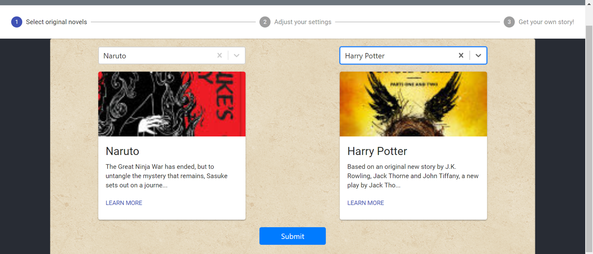
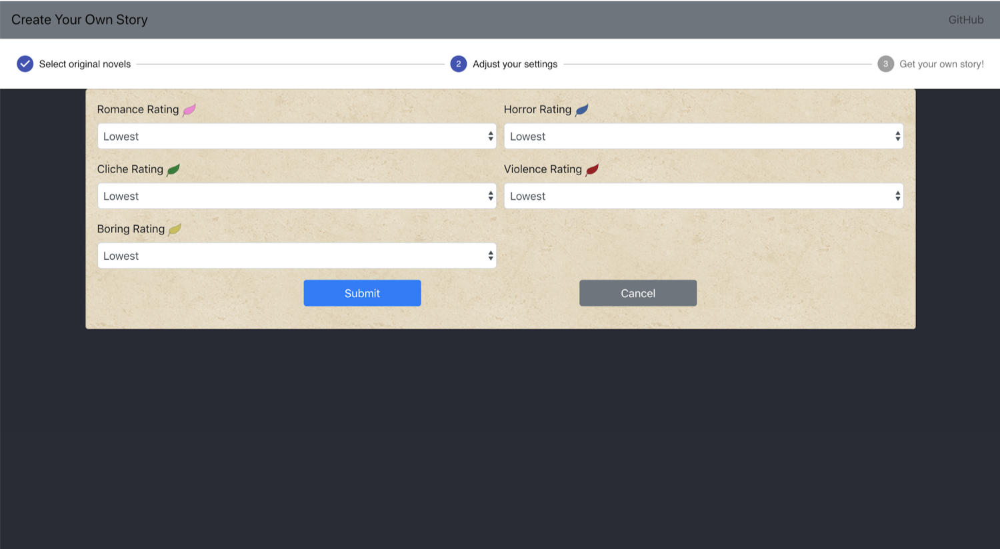
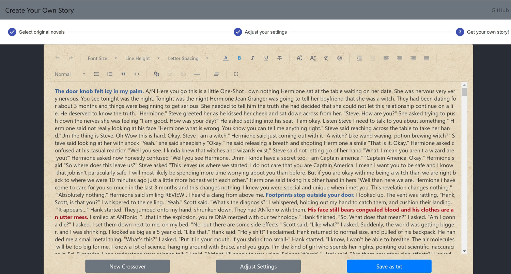

# Cross-over Fanfiction Story Generator: Create Your Own Story (CYOS)

We have created a crossover fan-fiction generator using a Web-Crawler, a textrank algorithm, and NLP techniques using the Stanford NLTK Library.

## Demo

> Figure 1: Select two fanfictions to from DropDown Books (Names are preloaded)

> Figure 2: User can customize the settings of the story (Romance, Cliche, Boring rating, etc.)
 

> Figure 3: The generated story displayed in a editor, so the user can further polish the story and download the polished version
 

## Code
If you are interested in how to run our code in your own computer please refer to the following document:
[How to run CYOS Code](README_RUN.md)